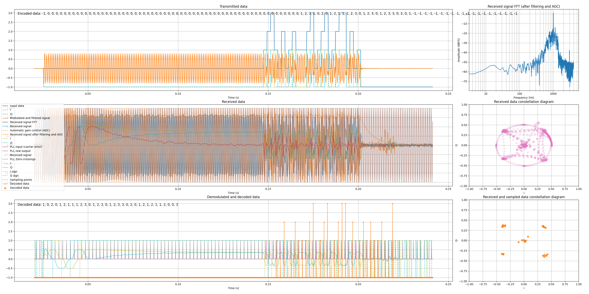

# 📡 QPSK-Demo
### Demonstration of a QPSK modulator / demodulator in the audio range (with the ability to run it through a real speaker / mic)



----------

### Block diagram of modulator section:


### Block diagram of demodulator section:


As you can see, I'm using a Costas Loop with a PI (Proportional-Integrator controller) to control the local oscillator

----------

The screenshot at the top shows an example of a "Hello!" message.

`TX_DATA`:
```python
# [-1] - Silence,
# [0] * 60 - PLL sync burst,
# [0, 1, 2, 3] - phase (IQ) sync (MUST BE EXACTLY THESE VALUES IN THIS ORDER),
# string_to_qpsk_array("Hello!") - Data (payload),
# [-1] * 20 - Silence
TX_DATA = [-1] + [0] * 60 + [0, 1, 2, 3] + string_to_qpsk_array("Hello!") + [-1] * 20
```

Program output:
```
Generated 1729 samples. Total time: ~0.236s
Added ~0.002s (14 samples) of delay
Carrier detected @ ~0.022s. RMS volume: -14.4dBFS
PLL locked @ ~0.098s. VCO: ~999.27Hz (error between 950.0Hz: 51863ppm). I: 1, Q: -1
Detected phase change @ ~0.145s. Sampling position: 2 samples after zero-cross
IQ values of phase 1 recorded @ ~0.146s. I: 1, Q: 1
IQ values of phase 2 recorded @ ~0.148s. I: -1, Q: -1
IQ values of phase 3 recorded @ ~0.150s. I: -1, Q: 1
Decoded data @ ~0.152s: 1 (0b01)
Decoded data @ ~0.154s: 0 (0b00)
Decoded data @ ~0.156s: 2 (0b10)
Decoded data @ ~0.158s: 0 (0b00)
Decoded byte: 0b01001000, char: H
Decoded data @ ~0.160s: 1 (0b01)
Decoded data @ ~0.162s: 2 (0b10)
Decoded data @ ~0.164s: 1 (0b01)
Decoded data @ ~0.166s: 1 (0b01)
Decoded byte: 0b01100101, char: e
Decoded data @ ~0.168s: 1 (0b01)
Decoded data @ ~0.170s: 2 (0b10)
Decoded data @ ~0.172s: 3 (0b11)
Decoded data @ ~0.174s: 0 (0b00)
Decoded byte: 0b01101100, char: l
Decoded data @ ~0.176s: 1 (0b01)
Decoded data @ ~0.178s: 2 (0b10)
Decoded data @ ~0.180s: 3 (0b11)
Decoded data @ ~0.182s: 0 (0b00)
Decoded byte: 0b01101100, char: l
Decoded data @ ~0.184s: 1 (0b01)
Decoded data @ ~0.186s: 2 (0b10)
Decoded data @ ~0.188s: 3 (0b11)
Decoded data @ ~0.190s: 3 (0b11)
Decoded byte: 0b01101111, char: o
Decoded data @ ~0.192s: 0 (0b00)
Decoded data @ ~0.194s: 2 (0b10)
Decoded data @ ~0.196s: 0 (0b00)
Decoded data @ ~0.198s: 1 (0b01)
Decoded byte: 0b00100001, char: !
Decoded data @ ~0.200s: 2 (0b10)
Decoded data @ ~0.202s: 1 (0b01)
Decoded data @ ~0.204s: 2 (0b10)
Decoded data @ ~0.206s: 1 (0b01)
Decoded byte: 0b10011001, char: ™
Decoded data @ ~0.208s: 1 (0b01)
Decoded data @ ~0.210s: 0 (0b00)
Decoded data @ ~0.212s: 3 (0b11)
Decoded data @ ~0.214s: 3 (0b11)
Decoded byte: 0b01001111, char: O
Decoded data @ ~0.216s: 0 (0b00)
Carrier lost and PLL unlocked @ ~0.216s. RMS volume: -30.0dBFS
Processing finished. Took 0.278s
```

As you can see the message is received and decoded successfully:
```
Decoded byte: 0b01001000, char: H
Decoded byte: 0b01100101, char: e
Decoded byte: 0b01101100, char: l
Decoded byte: 0b01101100, char: l
Decoded byte: 0b01101111, char: o
Decoded byte: 0b00100001, char: !
```

----------

### To test transmission using your speaker and microphone:

1. Install the PyAudio package
2. Ensure that your sound card supports the float32 format and the values of `CHUNK_SIZE` and `SAMPLING_RATE`
3. Set `USE_LINE_SIMULATION` to `False`
4. Make sure your speaker and microphone are selected as the default devices in your system
5. Place the microphone near the speaker and create a quiet environment
6. Run the script. You should hear the transmission. If the sound level is set correctly, you will see a message indicating the start and end of recording
